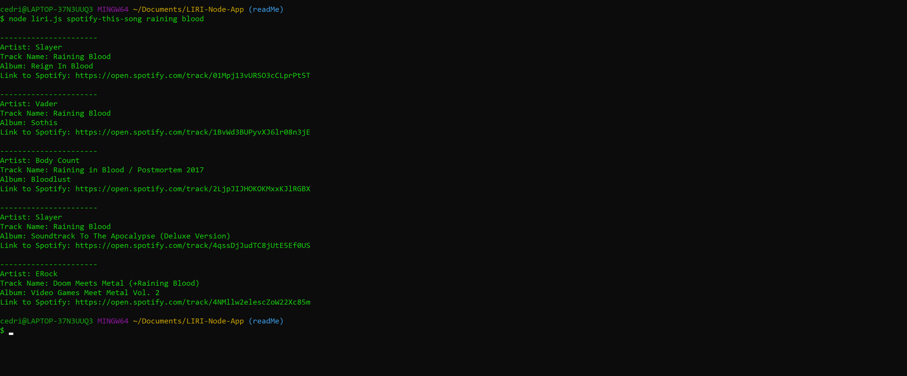

# LIRI-Bot   👾 
LIRI is like iPhone's SIRI. However, while SIRI is a Speech Interpretation and Recognition Interface, LIRI is a Language Interpretation and Recognition Interface. LIRI is a command line node app that takes in parameters and gives you back data.

### Functionality
LIRI will search Spotify for songs, Bands In Town for concerts, and OMDB for Movies

## Process 📋 
launch `node liri.js` & type in one of the following commands:

### 1. node liri.js concert-this <artist/band name here> 🎤 

* Inputing `concert-this` followed by any `artist/band name` will search the Bands in Town Artist Events API for an artist and render the following information about each event to the terminal:
    - Name of the venue
    - Venue location
    - Date of the Event
* Search is performed utilizing AXIOS using the following call format: 
`https://rest.bandsintown.com/artists/ + <artist/band name here> + /events?app_id=trilogy`

### 2. node liri.js spotify-this-song <song name here>  🎼 

- Inputing `spotify-this-song` followed by the `song name` will show the following information about the song in your terminal/bash window
    - Artist(s)
    - The song's name
    - A preview link of the song from Spotify
    - The album that the song is from
    - If no song is provided, program will default to "The Sign" by Ace of Base.
* Search is performed utilizing `Node-Spotify-API` using the following call format: 
` spotify.search({ type: 'track', query: song name, limit: 5 }, function (err, data) `

### 3. node liri.js movie-this <movie name here> 🎬

- Inputing `movie-this` followed by the `movie name` will output the following information to your terminal/bash window:
   * Title of the movie.
   * Year the movie came out.
   * IMDB Rating of the movie.
   * Rotten Tomatoes Rating of the movie.
   * Country where the movie was produced.
   * Language of the movie.
   * Plot of the movie.
   * Actors in the movie.

* Search is performed utilizing AXIOS using the following call format: 
`http://www.omdbapi.com/?t= + movieName + &y=&plot=short&apikey=trilogy`

   

### 4. node liri.js do-what-it-says ⁉️ 

- Inputing `do-what-it-says` will call on the random.txt file
- Using the fs Node package, LIRI will take the text inside of random.txt and then use it to call one of LIRI's commands.
- `fs.readFile("random.txt", "utf8", function (error, data)`

## Node Packages Used   🔨 
- [Node-Spotify-API](https://www.npmjs.com/package/node-spotify-api)
- [Axios](https://www.npmjs.com/package/axios)
- [Moment](https://www.npmjs.com/package/moment)
- [DotEnv](https://www.npmjs.com/package/dotenv)
